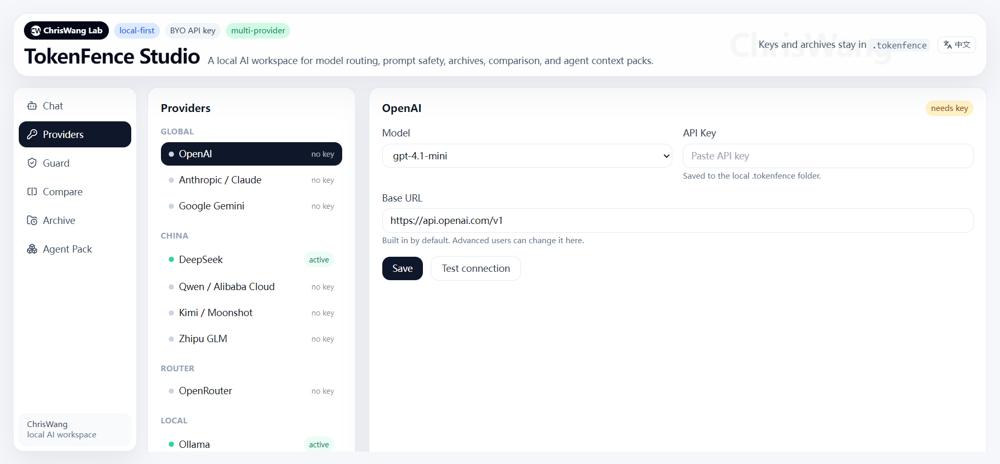

# TokenFence Studio

<p align="center">
  
</p>

<p align="center">
  <strong>Local-first prompt safety, model routing, and multi-model orchestration workspace for LLMs.</strong>
</p>

<p align="center">
  Prompt Guard · Model Matrix · File-level routing · Context compression · Agent-ready workflows
</p>

<p align="center">
  <a href="./README.zh-CN.md">中文</a> ·
  <a href="./docs/changelog/README.md">Update Log</a> ·
  <a href="https://github.com/Chrisbetheking/tokenfence-studio">GitHub</a>
</p>

---

## Overview

**TokenFence Studio** is an early-stage, local-first AI workspace that sits between users and large language models.

Instead of sending raw prompts directly to an LLM, TokenFence Studio runs a pre-flight layer first:

```text
Raw prompt / files
   ↓
Prompt Guard
   ↓
Sensitive data redaction
   ↓
Intent detection
   ↓
Context compression
   ↓
Model / file router
   ↓
Final prompt preview
   ↓
LLM provider or local model
```

The goal is to help developers and power users use LLMs in a safer, more transparent, and more controllable way.

---

## What makes it different?

Most AI tools focus on the chat interface or model access.

TokenFence Studio focuses on what happens **before** a prompt reaches a model:

- Is the prompt safe to send?
- Does it contain secrets or private data?
- Can the context be compressed?
- Which model is best for this task?
- Should this file go to a cloud model, a local model, or a different specialist model?
- Can multiple models be compared side by side?

This makes TokenFence Studio closer to a **pre-LLM safety and orchestration layer** than a normal ChatGPT-style UI.

---

## Screenshots

### Chat Workspace


### Provider Management



### Prompt Guard


---

## Core Features

### Prompt Guard

Scan prompts locally before they are sent to a model.

TokenFence Studio can detect common sensitive data patterns such as:

- API keys
- Emails
- Phone numbers
- Database URLs
- Access tokens
- Secret assignments
- Chinese personal identifiers
- Common credential leaks

### Redaction Engine

Replace detected sensitive values with safe placeholders while keeping the task understandable.

```text
john@example.com → [EMAIL_1]
sk-xxxxxxx       → [OPENAI_KEY_1]
```

### Policy Profiles

Choose how strictly TokenFence should process a prompt:

- **Strict privacy** — prefer safe, redacted, or local-only handling
- **Balanced** — protect risky content while keeping the workflow smooth
- **Fast** — minimal processing for low-risk prompts
- **Developer** — expose more details for debugging and inspection

### Model Matrix

Run one task across multiple models, or assign different files to different models.

Current capabilities include:

- Send the same prompt to multiple selected models
- Compare responses, latency, token usage, and risk status
- Paste multiple file contents and route each file separately
- Choose a model per file
- Mark files as public, private, or secret
- Route high-risk or secret files toward local models

### File-level Model Routing

Different files may need different models.

Examples:

| File | Recommended route |
|---|---|
| `src/app/page.tsx` | Coding-friendly model |
| `README.md` | Writing / documentation model |
| `error.log` | Long-context model |
| `.env` or secret config | Local model only |

### Multi-provider Support

TokenFence Studio supports multiple global, China-based, router, and local providers through native or OpenAI-compatible adapters.

Current presets include:

- OpenAI
- Anthropic Claude
- Google Gemini
- DeepSeek
- Volcengine Ark / Doubao
- Alibaba Cloud Bailian / Qwen
- Baidu Qianfan
- Kimi / Moonshot
- Zhipu GLM
- MiniMax
- SiliconFlow
- OpenRouter
- Groq
- Together AI
- 302.AI
- ModelScope
- Ollama
- LM Studio
- Custom OpenAI-compatible endpoint

Bring your own API key. No vendor lock-in.

### Context Compression

Compress long prompts or context while preserving key intent, constraints, and useful details.

### Local Archive

Store sanitized runs locally. No cloud database is required by default.

### Agent Context Packs

Prepare reusable context bundles for AI coding and agent workflows such as Claude Code, Codex, MCP-based agents, and OpenHands-style workflows.

---

## Planned: Search Grounding

Search grounding is planned as a future module.

The idea is to let TokenFence decide whether a request needs live web information, safely prepare the search query, retrieve sources, and inject grounded context before model execution.

Planned search providers / modes:

- Brave Search
- Tavily
- Gemini Grounding with Google Search
- Kimi Web Search
- Baidu search via SERP provider
- Custom search provider

Search will be controlled by the same safety layer:

- Block searching secrets
- Redact private search queries
- Choose Global / China / Auto region
- Show sources before final answer generation

---

## Architecture

```text
User input / uploaded files
        │
        ▼
Intent Engine
        │
        ▼
Prompt Guard
        ├── Scanner
        ├── Redactor
        ├── Risk Engine
        └── Compressor
        │
        ▼
Model Matrix / Router
        ├── Prompt-level multi-model run
        ├── File-level model routing
        ├── Local model preference for sensitive files
        └── Provider fallback / future judge model
        │
        ▼
Provider Layer
        ├── Global providers
        ├── China-based providers
        ├── Router providers
        └── Local providers
        │
        ▼
Response / comparison / archive
```

---

## Quick Start

```bash
git clone https://github.com/Chrisbetheking/tokenfence-studio.git
cd tokenfence-studio
npm install
npm run dev
```

Open:

```text
http://localhost:3000
```

### API Keys

Create a `.env.local` file or save keys in the Provider settings page.

Common environment variables:

```env
OPENAI_API_KEY=
ANTHROPIC_API_KEY=
GEMINI_API_KEY=
DEEPSEEK_API_KEY=
VOLCENGINE_API_KEY=
DASHSCOPE_API_KEY=
QIANFAN_API_KEY=
MOONSHOT_API_KEY=
ZHIPU_API_KEY=
MINIMAX_API_KEY=
SILICONFLOW_API_KEY=
OPENROUTER_API_KEY=
GROQ_API_KEY=
TOGETHER_API_KEY=
THREE_ZERO_TWO_API_KEY=
MODELSCOPE_API_KEY=
```

If you only use Ollama or LM Studio, cloud API keys are optional.

---

## Project Structure

```text
src/
 ├── app/
 ├── components/
 ├── lib/
 │   ├── core/
 │   ├── providers/
 │   ├── skills/
 │   └── vault/
 └── api/

mcp/
cli/
docs/
examples/
```

---

## Roadmap

### Current prototype

- [x] Chat workspace
- [x] Provider settings
- [x] Prompt Guard
- [x] Redaction engine
- [x] Context compression
- [x] Policy profiles
- [x] Model Matrix for multi-model comparison
- [x] File-level model routing prototype
- [x] Local archive
- [x] Agent context pack prototype

### Planned

- [ ] Search Grounding router
- [ ] Judge model for merging multi-model outputs
- [ ] Provider fallback chains
- [ ] Cost and latency budget router
- [ ] Real file upload parser for Model Matrix
- [ ] Source citation panel
- [ ] MCP marketplace
- [ ] VS Code extension
- [ ] Browser extension
- [ ] Local vector search
- [ ] Team workspace

---

## Update Log

Recent updates and development notes are available in the [Update Log](./docs/changelog/README.md).

---

## Contributing

Issues and pull requests are welcome.

Ideas that are especially helpful:

- New provider adapters
- Better detection rules
- Search grounding integrations
- File routing heuristics
- Model comparison workflows
- Agent / MCP use cases

---

## Author

Created by **ChrisWang**.

Building practical AI infrastructure.

---

## License

MIT License
