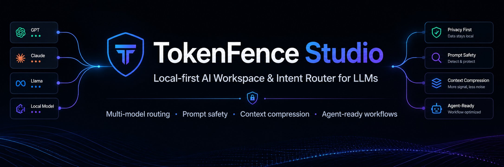

# TokenFence Studio

**Languages:** [English](README.md) | [绠€浣撲腑鏂嘳(README.zh-CN.md)

Local-first prompt safety, document intelligence, multi-model routing, and Codex-like chat workspace for LLMs.

**Chat Workspace** | **Prompt Guard** | **Context Pack** | **Model Routing** | **Token Budget**

## Latest Downloads

- [Android APK](https://github.com/Chrisbetheking/tokenfence-studio/releases/download/v1.0.0/TokenFence-Studio-Android-v1.0.0-release.apk)
- [Windows Portable ZIP](https://github.com/Chrisbetheking/tokenfence-studio/releases/download/v1.0.7/TokenFence-Studio-Windows-v1.0.7-portable.zip)

> Windows users: download the portable ZIP, extract it first, then run `tokenfence-studio.exe` from the extracted folder. Do not run the EXE directly from inside the ZIP preview.

[Releases](https://github.com/Chrisbetheking/tokenfence-studio/releases) | [Update Log](CHANGELOG.md) | [绠€浣撲腑鏂嘳(README.zh-CN.md)

---

## Overview

TokenFence Studio is a local-first AI workspace with a Codex-like chat interface.

It helps users work with prompts, files, context packs, model routing, token budgets, and provider-based AI workflows.

## What is included

- Codex-like Chat Workspace
- File attach and Context Pack
- Agent task status area
- Prompt Guard integration
- Token Budget / Token Calculator
- Model configuration status indicators
- Custom provider model aliases
- File-type based model routing
- Provider Hub
- Output generation
- English / Simplified Chinese UI

## Feature Matrix

| Area | Capability | Status |
|---|---|---|
| Chat Workspace | Sidebar, conversation list, composer, inspector | Working |
| File Attach | Attach text files and add them to Context Pack | Working |
| Context Pack | Files, characters, estimated tokens, context summary | Working |
| Agent Tasks | Idle, scanning, preparing, waiting, responding, done | Working |
| Prompt Guard | Scan user input and show guard results | Working |
| Token Budget | Estimate input, files, messages, and total tokens | Working |
| Model Status | Green/gray/amber/red provider status | Working |
| Model Routing | Route by file type and context rule | Working |
| Provider Hub | OpenAI, Claude, Gemini, DeepSeek, Qwen, Kimi, Doubao, Zhipu, Ollama, LM Studio, Custom | Working; requires keys |
| Toolbox | Plugin/output/media/computer-use entries | Preview |
| Projects | Project workspace entry | Coming soon |
| Settings | Configuration entry | Coming soon |

## Verified Workflows

1. Desktop launch from portable ZIP
2. Codex-like Chat Workspace as default screen
3. File attach entry
4. Context Pack display
5. Agent task status display
6. Prompt Guard result display
7. Token Budget display
8. Model status indicators
9. File-type based routing hints
10. Local conversation persistence

## Windows Usage

Download `TokenFence-Studio-Windows-v1.0.7-portable.zip`, extract it first, then run `tokenfence-studio.exe` from the extracted folder.

Do not run the EXE directly from inside the ZIP preview.

## Known Limitations

- Windows build is unsigned experimental.
- Provider calls require user-provided API keys.
- Android APK is carried forward from the previously verified Mobile Lite build.
- macOS is not included.
- Some Toolbox features are marked as Preview.
- Projects and Settings pages are still being expanded.

## License

MIT License
